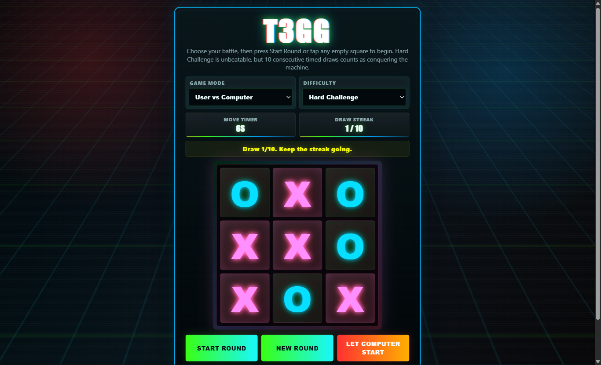

# T3GG

**T3GG** is a neon arcade-style Tic Tac Toe game built with **HTML, CSS, and vanilla JavaScript**.

It includes classic player-vs-player gameplay, player-vs-computer modes, animated RGB effects, and a special Hard Challenge mode where the AI is unbeatable — but the player can still “win” by surviving 10 consecutive timed draws.



## Features

* **User vs Computer**

  * Easy mode: random computer moves
  * Medium mode: blocks obvious wins and takes simple winning moves
  * Hard Challenge: unbeatable AI with a timer-based challenge system

* **User vs User**

  * Local 2-player mode on the same device

* **Hard Challenge Win Condition**

  * Since the Hard AI cannot be beaten normally, the player wins the challenge by drawing 10 rounds in a row.
  * Each move is timed to keep the pressure high.
  * If the player runs out of time, the computer wins and the streak resets.

* **Arcade Game Design**

  * RGB animated effects
  * Responsive full-screen mobile layout
  * Compact interface for small screens
  * Animated board interactions
  * Winning-cell effects

* **User-Friendly Gameplay**

  * Tap any empty cell to automatically start a round
  * Controls are locked during an active round to prevent resetting or switching modes as a cheat
  * Clean score tracking for both AI and 2-player modes

## Demo

Open the `index.html` file directly in your browser, or host it using GitHub Pages.

## How to Play

### User vs Computer

1. Choose **User vs Computer** mode.
2. Select a difficulty:

   * **Easy**
   * **Medium**
   * **Hard Challenge**
3. Click **Start Round** or tap any empty box to begin.
4. Try to win, draw, or survive the Hard Challenge.

### User vs User

1. Choose **User vs User** mode.
2. Player 1 uses **X**.
3. Player 2 uses **O**.
4. Take turns placing marks until someone wins or the round ends in a draw.

## Hard Challenge Rules

Hard mode uses unbeatable Tic Tac Toe logic.

That means the player cannot normally win by getting three in a row. Instead, the challenge is based on endurance and speed:

* Draw 1 round: streak increases
* Draw 10 rounds in a row: player wins the Hard Challenge
* Lose or run out of time: streak resets

## Project Structure

```text
T3GG/
├── index.html
├── screenshot.png
├── README.md
└── LICENSE
```

## Technologies Used

* HTML5
* CSS3
* Vanilla JavaScript

No frameworks, libraries, or build tools are required.

## Run Locally

Clone the repository:

```bash
git clone https://github.com/zaqxen/t3gg.git
```

Open the project folder:

```bash
cd YOUR-REPOSITORY-NAME
```

Then open `index.html` in your browser.

## GitHub Pages

You can publish the game for free using GitHub Pages:

1. Go to your repository settings.
2. Open **Pages**.
3. Select the branch you want to deploy, usually `main`.
4. Select the root folder.
5. Save and wait for GitHub to generate the live link.

## License

This project is licensed under the **MIT License**.

You are free to use, study, modify, and distribute this project as long as the license notice is included.

## Author

Created by **Mark Morgan Miranda**.
